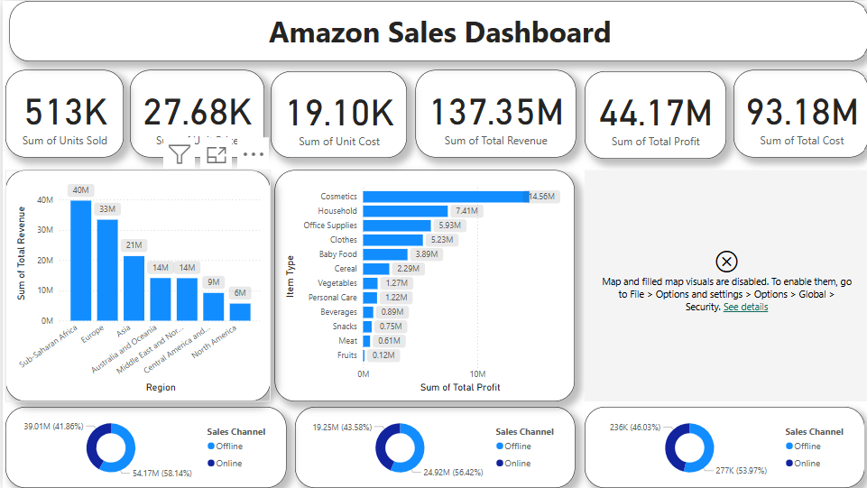
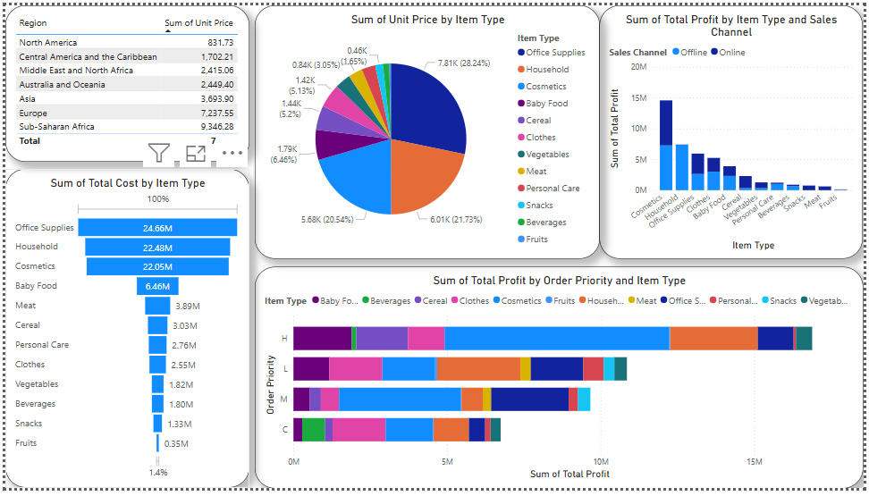
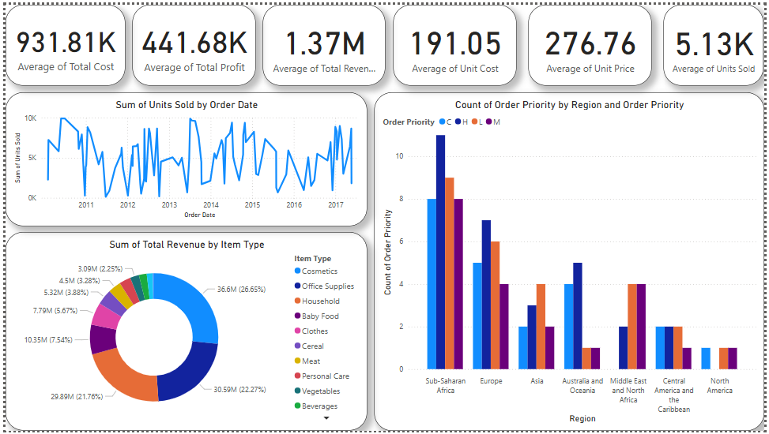

# Amazon Sales Analysis Final Project

## Overview
This project aims to analyze Amazon sales data to identify trends, key metrics, and relationships between various attributes. The project involves data extraction, transformation, and visualization using various tools and techniques.

## Technologies Used
- **Python** (for data processing and analysis)
- **Tableau** (for visualization)
- **Power BI** (for dashboard creation)
- **SQL** (for querying and data manipulation)

## Problem Statement
Sales management plays a crucial role in improving distribution efficiency, reducing costs, and increasing profits. The goal of this project is to perform ETL (Extract-Transform-Load) on Amazon sales data and analyze:
- Sales trends (month-wise, year-wise, yearly-month-wise)
- Key performance metrics
- Relationships between different attributes

## Power BI Dashboard

### 1. Dashboard Overview

### 2. Sales Performance

### 3. Key Metrics

## Dataset
The dataset can be accessed via the following link:
[Amazon Sales Dataset](https://drive.google.com/file/d/10sofXyF6NjwN6ngLyFfiPI-CUDpeqaN_/view?usp=share_link)

## Approaches
- **Data Cleaning & Processing**: Handling missing values, formatting, and structuring data for analysis.
- **Exploratory Data Analysis (EDA)**: Identifying trends, patterns, and insights.
- **Data Visualization**: Creating interactive dashboards using Tableau and Power BI.
- **Feature Engineering**: Deriving new insights from existing attributes.

## Key Metrics Analyzed
- **Total Revenue**: $137.35M
- **Total Cost**: $93.18M
- **Total Profit**: $44.17M
- **Units Sold**: 513K
- **Sales Channel Analysis** (Online vs. Offline)
- **Top Performing Product Categories**

## Project Evaluation Metrics
- **Modular Code**: Well-structured and reusable code.
- **Safe & Secure**: No harmful operations.
- **Testable**: Easily verifiable results.
- **Maintainable**: Scalable and adaptable for future modifications.
- **Portable**: Works across different environments.

## Visualization Insights
The analysis includes Power BI dashboards showcasing:
- Sales trends across regions and product categories.
- Revenue distribution by sales channel (Online vs. Offline).
- Key performance indicators such as total revenue, profit, and cost breakdown.

## Conclusion
This project provides a comprehensive analysis of Amazon sales data, leveraging data science and visualization tools to derive meaningful insights that help in strategic decision-making. 🚀